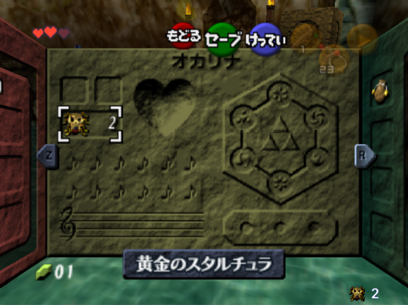
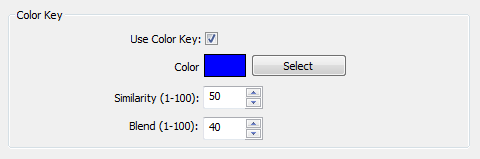
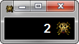
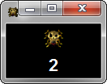
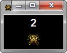

# --OOT Skulltula Counter--

Skulltula counter for Zelda Ocarina of Time written in Python.
Mainly intended for streaming or just for fun.
Automatically obtains skulltula the value from the running
**Mupen64** process.

Only tested to work with
[mupen64-rr v8](https://code.google.com/p/mupen64-rr/mupen64-rr).

## Open Broadcaster Software

Works well with [Open Broadcaster Software(OBS)](https://obsproject.com/).

Just change the background in your **user.conf** file to a color. Then
use OBS's **color key** function and select the same color:  

  

## Configuration

You should not edit the **"default.conf"** file. Instead you
should duplicate the file and rename the new file to **"user.conf"**.

| Name            | Default       | Description                                                                                  |
| ----------------| ------------- | -------------------------------------------------------------------------------------------- |
| BackgroundColor | **#000**      | Sets the background of the application. Useful for blending on streams.                      |
| Font            | **Helvetica** | Text font. Will work with any font installed on computer.                                    |
| FontSize        | **16**        | Text font size.                                                                              |
| FontColor       | **#FFF**      | Text font color.                                                                             |
| Bold            | **False**     | Makes text bold if set to True                                                               |
| Position        | **left**      | Position of elements. Can be set to **left, right, top, or bottom.** See below for details.  |
| UpdateInterval  | **100**       | Amount of time (in milliseconds) that the program waits before checking Mupen64 for changes. |
| SkullAddress    | **0xA06122**  | Memory address of skulltula value. Varies depending on OOT version. See below for details.   |

### Positioning

| Position | Example             | Position | Example                |
| -------- | ------------------- | -------- | ---------------------- |
| Left     |  | Right    |   |
| Top      |  | Bottom   |  |

### Skulltula Address

| Version  | Address      |
| -------- | ------------ |
| Jap v1.0 | **0xA062E2** |
| Jap v1.1 | N/A          |
| Jap v1.2 | N/A          |
| NA  v1.0 | **0xA06122** |
| NA  v1.1 | N/A          |
| NA  v1.2 | **0xA067D2** |
| EUR v1.0 | **0xA03F22** |
| EUR v1.1 | N/A          |
| EUR v1.2 | N/A          |

**If the address for your rom version is not available, just ask.**
**Alternatively you can use a program such as [MHS](http://memoryhacking.com/download.php) to find the value yourself. **
